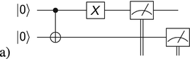
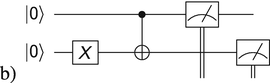
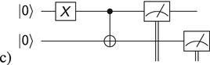
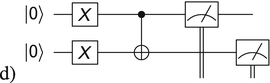
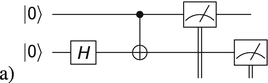
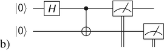
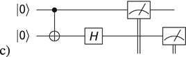
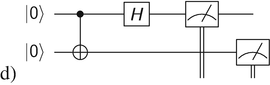
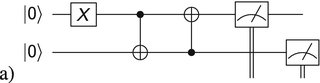
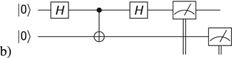

So far, we have discussed the manipulation and measurement of a single qubit. However, **quantum entanglement** is a physical phenomenon that occurs when multiple qubits are correlated with each other. Entanglement can have strange and useful consequences that could make quantum computers faster than classical computers. Qubits can be “entangled,” providing hidden quantum information that does not exist in the classical world. It is this entanglement that is one of the main advantages of the quantum world!

(sec-7-1)=
## 7.1 Entanglement Fundamentals

To provide one example of the strange behavior of entanglement, suppose we have two fair coins. Classically, if you flipped two fair coins many times, you would measure the outcomes HH, HT, TH, or TT, each occurring with a 25% probability. However, by quantum entangling these two fair coins, it is possible to create a state $(1/\sqrt {2})(\lvert HH\rangle + \lvert TT\rangle )$ as illustrated in Fig. [](#fig-7-1). Many other types of entangled states are possible, but this is one famous example called a Bell state. If you flipped this “entangled” pair of coins, they are entangled in such a way that only two measurement outcomes are possible: (1) both coins land on heads; or (2) both coins land on tails; each outcome occurring with 50% probability. You would never see HT or TH!

```{figure} ../images/ch-07/490703_1_En_7_Fig1_HTML.png
:name: fig-7-1

Two coins that are entangled in such a way that they either both land on HH or both land on TT.
```

Furthermore, if the two entangled coins are separated by thousands of miles, one coin can be flipped and measured. In this case, if the measured coin produced the outcome heads, then we automatically know that the other coin must also land on heads. If the measured coin produced the outcome tails, then we automatically know that the other coin must also land of tails! If this isn’t strange enough, this appears to suggest that the two coins can transmit information instantaneously, and possibly even faster than the speed of light (the fastest speed in the Universe), as shown in Fig. [](#fig-7-2). If the two coins are flipped at the exact same time, somehow the two coins know to land on the same side as the other even though there can be no classical communication between them.

```{figure} ../images/ch-07/490703_1_En_7_Fig2_HTML.png
:name: fig-7-2

Two coins are separated with no means of communication between each other. Classically, the flip of the second coin would be unrelated to the first flip. However, entangled coins would still produce correlated results.
```

How does the other coin instantaneously “know” what was measured on the other? Is information somehow being transmitted faster than the speed of light? Einstein called this behavior a “spooky action at a distance.”[^1] It has since been shown that no information is being transmitted from one place to the other, and so no information is being transmitted faster than the speed of light. Rather, the particles share non-classical information at the time of entanglement, which is then observed in the measurement process. The correlation between entangled qubits is the key that allows quantum computers to perform certain computations much faster than classical computers.

(sec-7-2)=
## 7.2 Hidden Variable Theory

It is tempting to think that there may be some classical explanation for entanglement. Did the entanglement change the fair coins by adding extra mass to the heads side or the tails side, thereby making them unfair? To provide a more realistic example in a classical system, consider a particle that decays into two lighter particles. The momenta of these three particles are related by the conservation of momentum: $\vec {p}_i = \vec {p}_{f1} + \vec {p}_{f2}$. Given a known total initial momentum, then by measuring the momentum of one of the final state particles, we can determine the momentum of the other final state particle. In summary, by measuring one particle’s momentum, we know the other. Momentum is the hidden classical variable that is encoded when the two particles are created. This is shown in Fig. [](#fig-7-3). Naturally, the question arises: is there a conceptually similar hidden variable in the quantum mechanical situation?

```{figure} ../images/ch-07/490703_1_En_7_Fig3_HTML.png
:name: fig-7-3

When a particle decays into two smaller particles, the decay products are “classically entangled” according to the conservation of momentum.
```

However, Bell’s theorem[^2] demonstrated that the correlation between entangled quantum particles is more than what is possible classically, disproving the idea of a hidden variable. All other potential loopholes have been resolved as of 2016.[^3] As such, entanglement is a purely quantum phenomenon with no classical explanation.

(sec-7-3)=
## 7.3 Multi-Qubit States

Given multiple qubits, the total state of the system can be written together in a single ket. For example, if coin #1 is heads and coin #2 is tails, the two-coin state is expressed as $\lvert HT\rangle$. In general, a system of two qubits can be in a superposition of four classical states, and written as

```{math}

\lvert\psi\rangle = \alpha_{00}\lvert00\rangle + \alpha_{01}\lvert01\rangle + \alpha_{10}\lvert10\rangle + \alpha_{11}\lvert11\rangle.
```

As we saw for the single qubit states, the coefficients $\alpha_{ij}$ are called the amplitudes and are generally complex numbers. Measuring the two qubits will collapse the system into one of the four basis states with probability given by $\alpha _{ij}^2$. This is shown in Fig. [](#fig-7-4).

```{figure} ../images/ch-07/490703_1_En_7_Fig4_HTML.png
:name: fig-7-4

A two-qubit system can collapse into one of four states with probability $\alpha _{ij}^2$.
```

### 7.3.1 Example

A system of two qubits is in a superposition state given by $\lvert \psi \rangle = \frac {1}{\sqrt {2}}\lvert 00\rangle +\frac {1}{2}\lvert 10\rangle -\frac {1}{2}\lvert 11\rangle$.

- (a) What is the probability of measuring both qubits as 1? $\text{Prob}\left (\lvert 11\rangle \right )=\left (-\frac {1}{2}\right )^2=\frac {1}{4}$.
- (b) If we only measure the first qubit and get a value of 1, what is the new state of the system?

  Since |00〉 is the only basis state of $\lvert \psi \rangle$ that doesn’t have a 1 in the first qubit, we eliminate the state |00〉 from the possibilities. This results in $\lvert \psi '\rangle =\frac {1}{2}\lvert 10\rangle -\frac {1}{2}\lvert 11\rangle$.

  Finally, we re-normalize the state so that the probabilities add up to 1. Therefore, the new state is $\lvert \psi '\rangle = \frac {1}{\sqrt {2}}\lvert 10\rangle -\frac {1}{\sqrt {2}}\lvert 11\rangle$.

(sec-7-4)=
## 7.4 Non-Entangled Systems

It is possible to have a system of particles that are not entangled with each other. In this case, changing one particle will not cause any change in the other particle. For example, in a classical system, flipping two coins and measuring one coin as heads does not tell you any information about whether or not the other coin will land on heads or tails. These events are said to be independent. If you wanted to calculate the probability of |*HT*〉, you would simply multiply the probability of getting H on coin #1 by the probability of getting T on coin #2. This is given by

```{math}

\text{Prob}\left(\lvert HT\rangle\right) = \left(\frac{1}{2}\right)\left(\frac{1}{2}\right) = \frac{1}{4}.
```

Non-entangled states are also called product states or separable states because they can be factored into a product of single-qubit states.[^4] The two single-qubit probabilities multiply to produce the two-qubit probabilities.

### 7.4.1 Example

One qubit is in a $\alpha_0|0\rangle + \alpha_1|1\rangle$ state, while another is in a $\beta_0|0\rangle + \beta_1|1\rangle$ state. What is the state of the non-interacting two-qubit system?

```{math}

\left(\alpha_0\lvert0\rangle + \alpha_1\lvert1\rangle\right)\left(\beta_0\lvert0\rangle + \beta_1\lvert1\rangle\right) = \alpha_0\beta_0\lvert00\rangle+\alpha_0\beta_1\lvert01\rangle+\alpha_1\beta_0\lvert10\rangle+\alpha_1\beta_1\lvert11\rangle.
```

(sec-7-5)=
## 7.5 Entangled Systems

Intuitively, any interaction between two or more qubits will cause the qubits to share some information between each other. This sharing of information from interactions causes emergent phenomena that we call entanglement. Mathematically, a multi-qubit state is entangled only if it cannot be expressed as a product state. However, determining if a general multi-qubit state can be expressed as a product state can be difficult. Instead, an easier test to determine if a system is entangled or not is to check if measuring the value of one qubit changes the probability distribution of the second qubit. We will use this test extensively.[^5] If this test is true, then the system is definitely entangled. However, if the probability distribution of the second qubit does not change in this test, then the system could still be entangled. In this case, the entanglement arises from the sharing of hidden information in the signs (or complex components) of the probability amplitudes of a general state. While the probabilities may not change (due to the amplitudes being squared), the relative signs have important consequences for constructive or destructive interference if more gates are applied to qubits. This concept will be explored in question 5 e).

### 7.5.1 Example

Is $\lvert \psi \rangle =\frac {1}{\sqrt {2}}\lvert 00\rangle +\frac {1}{\sqrt {2}}\lvert 11\rangle$ an entangled state?

Yes! To see this, examine qubit #2. The probabilities for measuring qubit #2 in the |0〉 or |1〉 states are originally 50∕50 respectively. However, if we measured qubit #1, then we know what the outcome of measuring qubit #2 will be with 100% certainty. The same argument holds if qubit #2 is measured first. As such, measuring one of the qubits affects the probability of measuring the other qubit in a certain state, and so they are entangled. Mathematically, an entangled state is a special multi-qubit superposition state that cannot be factored into a product of the individual qubits.

### 7.5.2 Example

Show that $\lvert \psi \rangle =\frac {1}{\sqrt {2}}\lvert 00\rangle +\frac {1}{\sqrt {2}}\lvert 11\rangle$ cannot be written as a product of two single qubits.

Assume that the state can be written as the product of two states.

```{math}
:label: eq-7-1

\frac{1}{\sqrt{2}}\lvert00\rangle + \frac{1}{\sqrt{2}}\lvert11\rangle \stackrel{?}{=} \left(\alpha_0\lvert0\rangle+\alpha_1\lvert1\rangle\right)\left(\beta_0\lvert0\rangle+\beta_1\lvert1\rangle\right),
```

```{math}
:label: eq-7-2

\stackrel{?}{=}\alpha_0\beta_0\lvert00\rangle+\alpha_0\beta_1\lvert01\rangle+\alpha_1\beta_0\lvert10\rangle+\alpha_1\beta_1\lvert11\rangle.
```

Comparing the amplitudes on the left vs. the right, the $\alpha_i$’s and $\beta_j$’s must satisfy:

```{math}
:label: eq-7-3

\alpha_0\beta_0 = \frac{1}{\sqrt{2}}, \quad  \alpha_0\beta_1 = 0, \quad  \alpha_1\beta_0=0, \quad  \alpha_1\beta_1=\frac{1}{\sqrt{2}}.
```

However, this is not possible. For example, take $\alpha_0\beta_1 = 0$. This means that either $\alpha_0 = 0$ or $\beta_1 = 0$. If $\alpha_0 = 0$, then $\alpha_0\beta_0 = 0$, but $\alpha _0\beta _0 =\frac {1}{\sqrt {2}}$ in the above equation. A similar contradiction occurs with $\beta_1 = 0$. So the initial assumption must be incorrect and this entangled state cannot be written as the product of two separate states.

(sec-7-6)=
## 7.6 Entangling Particles

As there are many different ways of building a quantum computer, there are many different ways of physically entangling particles. One method called “spontaneous parametric down-conversion” shines a laser at a special nonlinear crystal. The crystal splits the incoming photon into two photons with correlated polarizations. For example, one could produce a pair of photons that always have perpendicular polarizations (see Fig. [](#fig-7-5)). Just as the engineering aspect of building a quantum computer is outside the scope of this course, so is the technological aspect of how qubits are physically entangled. We will focus more on how entanglement is represented in a quantum computer and the uses of this.

```{figure} ../images/ch-07/490703_1_En_7_Fig5_HTML.png
:name: fig-7-5

A nonlinear crystal creates two photons with entangled polarizations.
```

(sec-7-7)=
## 7.7 CNOT Gate

You have already learned about the *X*, Hadamard, and *Z* gates. These act on a single qubit. There are also quantum gates that perform a logic operation on multiple qubits. The most important multi-qubit gate is the controlled NOT (CNOT) gate. The CNOT is used to entangle two qubits together and is essential in quantum computing/algorithms. The CNOT takes in two qubits, a control qubit and a target qubit, and outputs two qubits. The control qubit stays the same, while the target obeys the following rule.

- If the control qubit is |0〉, then leave the target qubit alone.
- If the control qubit is |1〉, then on the target qubit flip |0〉→|1〉 and |1〉→|0〉.

The truth table for the CNOT gate is shown in Table [](#tbl-7-1).[^6] From this one can deduce the matrix form of the CNOT gate as

(tbl-7-1)=
**Table 7.1** The truth table for the CNOT gate

| Before |        | After |        |
|--------|--------|-------|--------|
| Control bit | Target bit | Control bit | Target bit |
| \|0〉 | \|0〉 | \|0〉 | \|0〉 |
| \|0〉 | \|1〉 | \|0〉 | \|1〉 |
| \|1〉 | \|0〉 | \|1〉 | \|1〉 |
| \|1〉 | \|1〉 | \|1〉 | \|0〉 |

```{math}
:label: eq-7-4

\text{CNOT} = \begin{pmatrix} 1 & 0 & 0 & 0 \\ 0 & 1 & 0 & 0 \\ 0 & 0 & 0 & 1 \\ 0 & 0 & 1 & 0 \\ \end{pmatrix}.
```

Figure [](#fig-7-6) is the circuit for the CNOT gate. Plugging in the “Before” values from Table [](#tbl-7-1) into this circuit will produce the “After” values.

```{figure} ../images/ch-07/490703_1_En_7_Fig6_HTML.png
:name: fig-7-6

The CNOT gate performs an *X* gate on the target qubit if the control qubit is |1〉.
```

(sec-7-8)=
## 7.8 Notation Convention

When converting between bra-ket notation and circuit notation, there are two different conventions. Since we will be using the IBM quantum computer, we will adopt the IBM convention. This is shown in Fig. [](#fig-7-7). In the IBM notation, the topmost qubit in the circuit corresponds to the rightmost qubit in the bra-ket notation (|…*q*〉). IBM shorthand is top-down in circuit notation, which corresponds to right-left in bra-ket notation.

```{figure} ../images/ch-07/490703_1_En_7_Fig7_HTML.png
:name: fig-7-7

The two conventions for mapping circuit notation to the bra-ket notation, IBM (left) and Other (right). Note in this book we adopt the IBM convention as we run code on the IBM quantum computers.
```

The other convention, which we will **not** use going forward but provide in case it is seen in other resources, is shown in Fig. [](#fig-7-7). Here, the topmost qubit corresponds to the leftmost qubit in bra-ket notation (|*q*…〉). Top-down in circuit notation corresponds to left-right in bra-ket notation. We will not use this going forward.

(sec-7-9)=
## 7.9 Examples

1. Figure [](#fig-7-8) shows the quantum circuit sending |01〉 through a CNOT gate. What is the output?

   ```{figure} ../images/ch-07/490703_1_En_7_Fig8_HTML.png
   :name: fig-7-8

   The quantum circuit that sends a multi-qubit in the |01〉 state through a CNOT gate.
   ```

   The figure shows that, in IBM notation, the control qubit is on top and the target is on the bottom. Since the control is in the |1〉 state, the target qubit is flipped to |1〉. So measurement will always result in |11〉.

2. Examine Fig. [](#fig-7-9). The control qubit is in a superposition of |0〉 and |1〉. What is the effect of a CNOT gate?

   ```{figure} ../images/ch-07/490703_1_En_7_Fig9_HTML.png
   :name: fig-7-9

   The quantum circuit that sends a control qubit in a superposition state through a CNOT gate.
   ```

   Before the CNOT operation, in ket notation, the control qubit is in the $\frac {1}{\sqrt {2}}\lvert 0\rangle +\frac {1}{\sqrt {2}}\lvert 1\rangle$ state, while the target qubit is in the |0〉 state. The two-qubit input state is therefore $\frac {1}{\sqrt {2}}\lvert 00\rangle +\frac {1}{\sqrt {2}}\lvert 01\rangle$. Applying the rules for the CNOT, the first state |00〉 does not change as the control qubit is |0〉. However, for the second state |01〉, the control qubit is |1〉 and so the target qubit is flipped from |0〉 to |1〉. The result of the CNOT gate is the state $\frac {1}{\sqrt {2}}\lvert 00\rangle +\frac {1}{\sqrt {2}}\lvert 11\rangle$. The histogram from measuring this state is shown in Fig. [](#fig-7-10). This is a special state called the Bell state.

   ```{figure} ../images/ch-07/490703_1_En_7_Fig10_HTML.png
   :name: fig-7-10

   The measurement histogram produced by running the circuit in Fig. [](#fig-7-9). Reprint courtesy of International Business Machines Corporation, ⒸInternational Business Machines Corporation.
   ```

   The two qubits are entangled after the CNOT! As illustrated in the previous example, this state cannot be written as the product of two separate qubits. As with the single-qubit gates, the CNOT gate operates on ALL states in the superposition, e.g., the CNOT gate acts on the four basis states of a two qubit system simultaneously. Quantum algorithms leverage this parallelism to ensure speed improvements over classical computers. In addition, as with all quantum gates, the CNOT is reversible, meaning the operation can be undone (which can be used to figure out the original qubit states).

(sec-7-10)=
## 7.10 Big Ideas

1. Entanglement is the sharing of non-classical information between two or more quantum states. This is caused by quantum states or qubits interacting with each other.
2. Entanglement is needed to make quantum computers perform calculations which classical computers cannot.
3. Two-qubit gates act on two different qubits simultaneously and creates entanglement. The controlled NOT (CNOT) gate is frequently used for this purpose.[^7]

(sec-7-11)=
## 7.11 Activities

Correlation in Entangled States Lab in Worksheet [](#sec-10-1)

Schrödinger’s Worm Using Five Qubits in Worksheet [](#sec-10-4)

For those interested in hands-on experiments, see QuTools[^8]

(sec-7-12)=
## 7.12 Check Your Understanding

1. For each of the questions below, assume that two-qubits start in the state

   ```{math}
   :label: eq-7-5

   \lvert\psi\rangle = \frac{1}{\sqrt{2}}\lvert00\rangle+\frac{1}{2}\lvert10\rangle-\frac{1}{2}\lvert11\rangle.
   ```

   - (a) What is the probability of measuring both qubits as 0?
   - (b) What is the probability of measuring the first qubit as 1?
   - (c) What is the probability of measuring the second qubit as 0?
   - (d) What is the new state of the system after measuring the first qubit as 0?
   - (e) What is the new state of the system after measuring the first qubit as 1?

2. Two fair coins are flipped. What is the state of the two-coin system while the coins are in the air?
3. Is $\frac {1}{\sqrt {2}}\lvert 00\rangle +\frac {1}{\sqrt {2}}\lvert 01\rangle$ an entangled state? If so, show that it cannot be written as a product. If not, what is the individual state of the two qubits?
4. Are the following two-qubit states entangled?
   - (a) $\frac {1}{\sqrt {2}}|{01}\rangle +\frac {1}{\sqrt {2}}|{10}\rangle$
   - (b) $\frac {1}{\sqrt {2}}|{01}\rangle -\frac {1}{\sqrt {2}}|{10}\rangle$
   - (c) $\frac {\sqrt {3}}{2}|{00}\rangle +\frac {1}{{2}}|{11}\rangle$
   - (d) $\frac {1}{\sqrt {2}}|{10}\rangle +\frac {1}{\sqrt {2}}|{11}\rangle$
   - (e) $\frac {1}{2}|{00}\rangle +\frac {1}{2}|{01}\rangle +\frac {1}{2}|{10}\rangle -\frac {1}{2}|{11}\rangle$
   - (f) $\frac {1}{\sqrt {2}}|{00}\rangle +\frac {1}{2}|{10}\rangle -\frac {1}{2}|{11}\rangle$
5. Two qubits are passed through a CNOT. In IBM notation, the qubit on the right is the control qubit. What is the output for the following initial states?
   - (a) |00〉
   - (b) |01〉
   - (c) |11〉
   - (d) $\frac {1}{\sqrt {2}}|{01}\rangle +\frac {1}{\sqrt {2}}|{10}\rangle$
   - (e) $\frac {1}{\sqrt {2}}|{00}\rangle +\frac {1}{2}|{10}\rangle -\frac {1}{2}|{11}\rangle$
6. The output of a CNOT gate is shown in Fig. [](#fig-7-11). What were the inputs?

   ```{figure} ../images/ch-07/490703_1_En_7_Fig11_HTML.png
   :name: fig-7-11

   CNOT gate for Problem 6
   ```

7. Can you predict the state produced by these quantum circuits? Try them out on the IBM quantum computer.
   - (a) 
   - (b) 
   - (c) 
   - (d) 
8. Can you predict which states will be produced by these quantum circuits?
   - (a) 
   - (b) 
   - (c) 
   - (d) 
9. Can you predict the state produced by these quantum circuits? Note: to put the circuit in a) on the IBM quantum computer, you need to use the code (rather than the click-and-drag interface) to put the second CNOT control on the bottom qubit.
   - (a) 
   - (b) 
10. Use the IBM Q[^9] simulator to create the entangled state $\frac {1}{\sqrt {2}}|{01}\rangle +\frac {1}{\sqrt {2}}|{10}\rangle$.
11. Suppose Alice has one half of an entangled pair and Bob has the other half. When Alice makes a measurement on her qubit, Bob’s qubit instantaneously changes its state. Can Alice and Bob use entanglement to transmit information faster than the speed of light? Why or why not?

[^1]: “Bounding the speed of spooky action at a distance.” *Physical Review Letters*. 110: 260407. 2013. [arXiv:1303.0614](https://arxiv.org/abs/1303.0614).

[^2]: [https://brilliant.org/wiki/bells-theorem/](https://brilliant.org/wiki/bells-theorem/).

[^3]: The BIG Bell Test Collaboration (9 May 2018). “Challenging local realism with human choices.” *Nature*. 557: 212–216. [doi:10.1038/s41586-018-0085-3](https://doi.org/10.1038/s41586-018-0085-3).

[^4]: More recently, it has been shown that there can exist quantum correlations in separable states that are not due to entanglement. These are called quantum discord: [https://en.wikipedia.org/wiki/Quantum_discord](https://en.wikipedia.org/wiki/Quantum_discord).

[^5]: There are ways to test for entanglement without the need to factorise a multi-qubit state into single qubit states. Namely, whether the trace of the density matrix for the subsystem squared is equal to 1. However, the mathematical necessities for this test are outside the scope of this course.

[^6]: [https://en.wikipedia.org/wiki/Controlled_NOT_gate](https://en.wikipedia.org/wiki/Controlled_NOT_gate).

[^7]: In fact, three single qubit gates (the Hadamard, phase, and *π*∕8 phase-rotation) in combination with the CNOT form a universal set of gates, i.e., all other gates can be made up from them.

[^8]: [https://www.qutools.com/quantum-physics-education-science-kits/](https://www.qutools.com/quantum-physics-education-science-kits/).

[^9]: [https://quantum-computing.ibm.com](https://quantum-computing.ibm.com).
