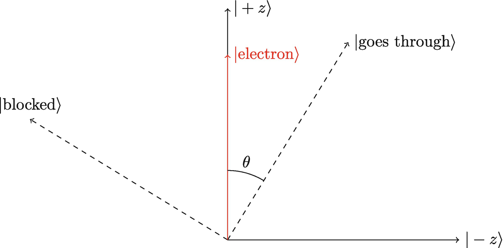
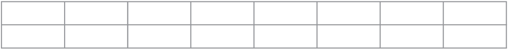
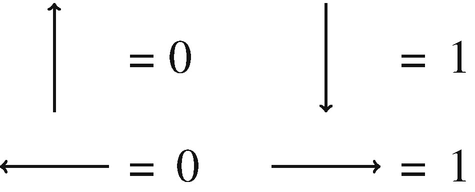
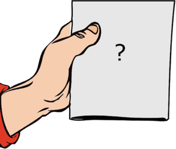

(sec-10-1)=
## 10.1 Correlation in Entangled States Lab

**Objectives:**

- Experimentally determine the difference between two particles in a product state vs. an entangled state using the [entanglement simulator](https://www.st-andrews.ac.uk/physics/quvis/simulations_html5/sims/entanglement/entanglement.html).[^1]
- Apply the idea of basis changing to explain the correlation that is observed.

**Questions** Alice and Bob each measure one of two qubits with a Stern-Gerlach apparatus. Start with both SGAs along the z-axis (Fig. [](#fig-10-1)).

```{figure} ../images/ch-10/490703_1_En_10_Fig1_HTML.png
:label: fig-10-1

:alt: Figure reproduced from the [QuVis website](https://www.st-andrews.ac.uk/physics/quvis/), licensed under Creative Commons CC-BY-NC-SA


Figure reproduced from the [QuVis website](https://www.st-andrews.ac.uk/physics/quvis/), licensed under Creative Commons CC-BY-NC-SA.
```


1. Try sending pairs of particles in a product state |*↑*~A~⟩|*↓*~B~⟩. What do Alice and Bob measure individually?
2. Try sending pairs of particles in an entangled state: $\frac {1}{\sqrt {2}}\left (|{\uparrow _A}\rangle |{\downarrow _B}\rangle -|{\downarrow _A}\rangle |{\uparrow _B}\rangle \right )$. What do Alice and Bob measure individually?
3. If Alice measures her spin, would you be able to predict Bob’s result:
   - (a) In the product state?
   - (b) In the entangled state?

Now rotate both SGAs along the x-axis (Fig. [](#fig-10-2)).

```{figure} ../images/ch-10/490703_1_En_10_Fig2_HTML.png
:label: fig-10-2

:alt: Figure reproduced from the [QuVis website](https://www.st-andrews.ac.uk/physics/quvis/), licensed under Creative Commons CC-BY-NC-SA


Figure reproduced from the [QuVis website](https://www.st-andrews.ac.uk/physics/quvis/), licensed under Creative Commons CC-BY-NC-SA.
```


4. Try sending pairs of particles in a product state |*↑*~A~⟩|*↓*~B~⟩. What do Alice and Bob measure individually?
5. Try sending pairs of particles in an entangled state $\frac {1}{\sqrt {2}}\left (|{\uparrow _A}\rangle |{\downarrow _B}\rangle -|{\downarrow _A}\rangle |{\uparrow _B}\rangle \right )$. What do Alice and Bob measure individually?
6. If Alice measures her spin, would you be able to predict Bob’s result:
   - (a) In the product state?
   - (b) In the entangled state?
7. Convert the product state |*↑*~A~⟩|*↓*~B~⟩ into the *x*-basis and use it to explain the observations in the *x*-basis. Recall that $|{\uparrow }\rangle =\frac {1}{\sqrt {2}}\left (|{+}\rangle +|{-}\rangle \right )$ and $|{\downarrow }\rangle =\frac {1}{\sqrt {2}}\left (|{+}\rangle -|{-}\rangle \right )$.
8. Convert the entangled state $\frac {1}{\sqrt {2}}\left (|{\uparrow _A}\rangle |{\downarrow _B}\rangle -|{\downarrow _A}\rangle |{\uparrow _B}\rangle \right )$ into the *x*-basis and use it to explain the measurements in the *x*-basis.
9. Suppose that there are two possible sources of particles. Source #1 randomly emits two particles in either the state |*↑*~A~⟩|*↓*~B~⟩ or |*↓*~A~⟩|*↑*~B~⟩ with equal probability. Source #2 emits two particles in the entangled state $\frac {1}{\sqrt {2}}\left (|{\uparrow _A}\rangle |{\downarrow _B}\rangle -|{\downarrow _A}\rangle |{\uparrow _B}\rangle \right )$. How can Alice and Bob tell whether the source is #1 or #2?

(sec-10-2)=
## 10.2 Polarizer Demo

For students who have learned about polarization, the creation of superposition states can be demonstrated using three [polarizing filters](https://www.arborsci.com/polarizing-filters.html). When unpolarized light is sent through a vertical filter, only vertically polarized light is able to pass through. Sending vertically polarized light through a horizontal filter results in no light passing through, since the vertical and horizontal polarizations are mutually exclusive. Surprisingly, adding a diagonal filter in between recovers the light! The diagonal polarizer introduced a horizontally polarized component, similar to how passing a spin-up electron through a horizontal SGA created a horizontal superposition.

**Question** Relate the behavior of the polarizers to what you saw in the SGAs. Hint: think of the top two polarizers in Fig. [](#fig-10-3) as the *z*-basis, and diagonal polarizers as the *x*-basis.

```{figure} ../images/ch-10/490703_1_En_10_Fig3_HTML.png
:label: fig-10-3

:alt: Unpolarized light is sent through a series of polarizing filters


Unpolarized light is sent through a series of polarizing filters.
```


(sec-10-3)=
## 10.3 Quantum Tic-Tac-Toe

Quantum Tic-Tac-Toe was developed by Allan Goff in 2004 as a metaphor to teach quantum concepts such as superposition, entanglement, and measurement collapse. It has been found to be a helpful strategy in teaching quantum mechanics to undergraduate students at Purdue, especially for students who struggle with grasping the concepts.[^2]

Quantum Tic-Tac-Toe resembles the classical Tic-Tac-Toe game in its setup and objective of completing three in a row. However, the game uses characteristics of quantum systems, so instead of using one marker *X* or *O*, the players use pairs of *X*s and *O*s, which are traditionally called “spooky,” after Einstein’s reference to entanglement as “spooky action at a distance”.[^3] Using indices for each marker’s move is important when determining the winner of the game. Additionally, we use a color code for each player and connect the spooky markers to help students better visualize the game process. We also number the squares for future reference.

### 10.3.1 The Rules

1. The X player goes first. We note that keeping indices helps to track the game. The markers can be placed in any two of the spaces on the game board (Fig. [](#fig-10-4)).

   ```{figure} ../images/ch-10/490703_1_En_10_Fig4_HTML.png
   :label: fig-10-4

   :alt: The Quantum Tic-Tac-Toe layout with numbered squares (left): one player’s move with spooky markers *x*~1~ (right)


   The Quantum Tic-Tac-Toe layout with numbered squares (left): one player’s move with spooky markers *x*~1~ (right).
   ```


2. The O player goes next. The markers can be placed in any two squares, even ones that are already occupied by other X or O markers. Notice in Fig. [](#fig-10-5) that the index for the O player also starts with 1, representing its first move placing markers in squares 1 and 6.

   ```{figure} ../images/ch-10/490703_1_En_10_Fig5_HTML.png
   :label: fig-10-5

   :alt: Example of the second player’s move


   Example of the second player’s move.
   ```


3. Player X goes again and can place their spooky markers at any two squares, even ones occupied by other Xs or Os. The game goes on until the players create a “cyclic loop” as seen in Fig. [](#fig-10-6).

   ```{figure} ../images/ch-10/490703_1_En_10_Fig6_HTML.png
   :label: fig-10-6

   :alt: The cyclic loop is created by the player X. Using lines between the spooky markers helps in identifying the loop


   The cyclic loop is created by the player X. Using lines between the spooky markers helps in identifying the loop.
   ```


4. **Collapsing the quantum state**. When a loop is created, the players have to collapse their state. There are three options for who makes the decision on how the markers will be collapsed. The fair choice would be by the player who did not create the cycle (in this case, player O). When the markers are forced to collapse, only one of the two squares for each move can be chosen, so player O can choose either square 4 or 6. Depending on their choice, the outcome would be different (Fig. [](#fig-10-7)). Once the states are collapsed, the “spooky markers” change into classical markers and they fully occupy the state of one particular square.

   ```{figure} ../images/ch-10/490703_1_En_10_Fig7_HTML.png
   :label: fig-10-7

   :alt: The two collapse outcomes due to player O’s decision


   The two collapse outcomes due to player O’s decision.
   ```


5. The next player can place his or her spooky markers in any two squares except the ones that are occupied by the collapsed markers. The game goes on until another cycle is created and the players are forced to collapse the state.
6. **Winning the game**. In some cases both players will create three in a row after collapsing their spooky markers. In this case, the player with the smallest sum of indexes wins. For example, in Fig. [](#fig-10-8) player X wins because they have the smaller sum.

   ```{figure} ../images/ch-10/490703_1_En_10_Fig8_HTML.png
   :label: fig-10-8

   :alt: Player X wins, because the sum of their indexes is 1 + 2 + 3 = 6. Player O got three in a row, but the sum of their indexes is 2 + 1 + 4 = 7


   Player X wins, because the sum of their indexes is 1 + 2 + 3 = 6. Player O got three in a row, but the sum of their indexes is 2 + 1 + 4 = 7.
   ```


**Some Other Rules Can Be Added or Modified** One of the requirements could be that players cannot place both markers in the same square like the one shown in Fig. [](#fig-10-9). Another way to make the collapse more quantum (or more random) is using a coin flip to decide which player chooses the collapse.

```{figure} ../images/ch-10/490703_1_En_10_Fig9_HTML.png
:label: fig-10-9

:alt: A player cannot put both markers in the same square


A player cannot put both markers in the same square.
```


Other modifications may include assigning different point values for three in a row, for example, the winner with the lowest sum of the indexes gets 1 point, while the other player gets 1/2 point.

One of the main challenges of playing the game is to observe when a cycle has been created so the state of the spooky markers can be collapsed at the right time. A computer-simulated game will automatically keep track of this and will force students to collapse their markers, such as this [game simulator](http://qttt.rohanp.xyz/).[^4]

We found that using color codes and connecting lines helps visually track loops. Another way is to create a model of the game where students can see the connections and collapse the states using physical pieces. It would be interesting to see students’ responses as to which medium helps them understand the game principle better.

### 10.3.2 Connection to Quantum Physics

How are the game rules and principles connected to the real applications of quantum mechanics? There are three major themes that can be drawn from the game: superposition, the effect of measurement, and entanglement.

**Superposition** In classical physics all objects have defined states. However, quantum systems can exist in a superposition of several classical states at the same time. The example could be an electron with a spin that is in a superposition of up and down, or a photon in a superposition of vertical and horizontal polarization. QTTT spooky markers exist in two separate locations on the game board, representing their state as a superposition state of two classical TTT markers.

**Measurement** When the state of a quantum system is measured, the quantum state collapses and only one classical state is observed with some probability. In QTTT, the rule of creating the loop forces players to collapse their markers (measure their quantum state). In this case the player decides how to collapse the markers, which corresponds to the scientist choosing the way of measuring a quantum system, such as axis orientation. The rule of forcing the measurement when the loop is created does not have an exact corresponding physical meaning. Quantum systems can exist in a superposition state for an extended time, and the measurement is not forced, but chosen by the observer.

**Entanglement** Entanglement is the quantum phenomenon of creating two or more particles, whose states cannot be described separately, but have some correlation even when they are separated by a significant distance. When the state of one of the entangled particles is measured, the state of the other particle can be known even without measurement. Einstein called it “spooky action at a distance.” When the players collapse their states after creating a loop in QTTT, they know for sure which state each marker would collapse into.

(sec-10-4)=
## 10.4 Schrödinger’s Worm Using Five Qubits

**Objectives** Design, build, and test quantum circuits that model systems in superposition and entanglement.

**Setup** Open the [IBM Q simulator](https://quantum-computing.ibm.com)[^5] and start a new circuit in the Circuit Composer (Fig. [](#fig-10-10)).

```{figure} ../images/ch-10/490703_1_En_10_Fig10_HTML.png
:label: fig-10-10

:alt: A new experiment on the IBM Q Circuit Composer. Reprint courtesy of International Business Machines Corporation, ⒸInternational Business Machines Corporation


A new experiment on the IBM Q Circuit Composer. Reprint courtesy of International Business Machines Corporation, ⒸInternational Business Machines Corporation.
```


The default is 5 qubits initialized to the |0⟩ state. Gates can be applied by dragging and dropping them onto the appropriate qubit(s). Don’t forget to add the measurement gate at the end to see the results. When you are satisfied with your circuit, save the experiment and click Run (Fig. [](#fig-10-11)).

```{figure} ../images/ch-10/490703_1_En_10_Fig11_HTML.png
:label: fig-10-11

:alt: Options for running the IBM Q experiment. Reprint courtesy of International Business Machines Corporation, ⒸInternational Business Machines Corporation


Options for running the IBM Q experiment. Reprint courtesy of International Business Machines Corporation, ⒸInternational Business Machines Corporation.
```


By default, the circuit will be evaluated 1024 times using the simulator backend. You may also run the circuit on a real quantum computer, subject to a waiting period. Increasing the number of shots will increase the statistical accuracy of the results at the expense of run-time. After you have run the circuit, the results will appear in a link at the bottom of the page.

**Part I: Superposition** The worm is alive when all five squares are black and dead when only four are black. Use a 0 to represent a white square and 1 to represent a black square (Fig. [](#fig-10-12)).

1. What is the classical state of the live 5-bit worm?
2. What is the classical state of the dead 5-bit worm?
3. Use IBM Q to create a worm in a superposition state of alive and dead. Let q[0] correspond to the bit on the far right.
4. Run the simulation and interpret the histogram.
5. How can you modify the circuit so that the worm is first put in a superposition state and then brought to life?
6. How can you modify the circuit so that the worm in a superposition state becomes definitely dead?

```{figure} ../images/ch-10/490703_1_En_10_Fig12_HTML.png
:label: fig-10-12

:alt: Dead or alive worms


Dead or alive worms.
```


**Part II: Entanglement** The worm is next to a hungry bird, such that the worm is either alive or chomped to pieces (Fig. [](#fig-10-13)).

7. What is the classical state of the very dead worm?
8. Create a circuit that produces a worm in a superposition state of alive and very dead. (Hint: Two of the qubits are entangled.)
9. Run the simulation and interpret the histogram.
10. How can you modify the circuit so that the worm in a superposition state becomes either definitely dead or definitely alive?

```{figure} ../images/ch-10/490703_1_En_10_Fig13_HTML.png
:label: fig-10-13

:alt: Very dead or alive worms


Very dead or alive worms.
```


**Further Resources**

- The [Qiskit webpage](https://qiskit.org/)[^6] has resources for YouTube videos and other educational links.
- IBM quantum offers a (virtual) [summer school](https://qiskit.org/events/summer-school/)[^7] with minimal prerequisites required.

(sec-10-5)=
## 10.5 Superposition vs. Mixed States Lab

### Objectives

- Experimentally determine the difference between particles in a **superposition state** and a **mixed state** using the [superposition states and mixed states simulator](https://www.st-andrews.ac.uk/physics/quvis/simulations_html5/sims/superposition/superposition-mixed-states.html).[^8]
- Apply the idea of basis changing to explain the experimental results.
- Compute the probability amplitudes given measurement results.

### Questions

1. We send 100 electrons of unknown spin into a Stern-Gerlach apparatus. We measure that 50 are spin up and 50 are spin down. We can conclude that:
   - (a) 100 electrons were in a 50/50 superposition state of up and down (superposition state).
   - (b) The electrons were a classical mixture of 50 electrons with spin up and 50 electrons with spin down (mixed state).
   - (c) Not enough information
2. Use the simulator (Fig. [](#fig-10-14)) to compare the measurement outcomes of the mixed particles vs. the superposition particles. What are the similarities and differences?

   ```{figure} ../images/ch-10/490703_1_En_10_Fig14_HTML.png
   :label: fig-10-14

   :alt: Figure reproduced from the [QuVis website](https://www.st-andrews.ac.uk/physics/quvis/), licensed under Creative Commons CC-BY-NC-SA


   Figure reproduced from the [QuVis website](https://www.st-andrews.ac.uk/physics/quvis/), licensed under Creative Commons CC-BY-NC-SA.
   ```


3. By making a basis change with $|0\rangle =\frac {1}{\sqrt {2}}|{+}\rangle +\frac {1}{\sqrt {2}}|{-}\rangle$ and $|1\rangle =\frac {1}{\sqrt {2}}|{+}\rangle -\frac {1}{\sqrt {2}}|{-}\rangle$, can you explain the similarities and differences mathematically?
4. Which of the two inputs labeled “Superposition or mixture?” and “Superposition or mixture??” is a random mixture and which is a superposition?
5. The mixture consists of a fraction *A* of spin up particles and a fraction *B* of spin down particles. Find these fractions, *A* and *B*.
6. The superposition state can be written as *α*|0⟩ + *β*|1⟩. Find the amplitudes *α* and *β* assuming they are real and positive.
7. Use a basis change to show that the amplitudes *α* and *β* give the correct probabilities in both the *x*- and *z*-basis.

(sec-10-6)=
## 10.6 Measurement Basis Lab

### Objectives

- Use the [PHET Stern-Gerlach Simulator](https://phet.colorado.edu/sims/stern-gerlach/stern-gerlach_en.html)[^9] to see how changing the orientation of the Stern-Gerlach Apparatus (SGA) affects the spin measurement.
- Perform calculations to write the spin in a different measurement basis (Fig. [](#fig-10-15)).

  ```{figure} ../images/ch-10/490703_1_En_10_Fig15_HTML.png
  :label: fig-10-15

  :alt: Figure reproduced from the [PHET Stern-Gerlach Simulator website](https://phet.colorado.edu/sims/stern-gerlach/stern-gerlachen.html), licensed under Creative Commons CC-BY


  Figure reproduced from the [PHET Stern-Gerlach Simulator website](https://phet.colorado.edu/sims/stern-gerlach/stern-gerlach_en.html), licensed under Creative Commons CC-BY.
  ```


| Angle of SGA (*θ*~SGA~) | Probability of going through | Probability of being blocked |
| --- | --- | --- |
| 0° |  |  |
| 15° |  |  |
| 30° |  |  |
| 45° |  |  |
| 60° |  |  |
| 75° |  |  |
| 90° |  |  |
| 105° |  |  |
| 120° |  |  |
| 135° |  |  |
| 150° |  |  |
| 165° |  |  |
| 180° |  |  |

### Questions

1. Send spin up electrons through a single SGA and record the measurement probabilities for different SGA angles (see above table).
2. Generate a scatter plot of the data.
3. What function describes the shape of the graph?
4. Write the state of the spin up electron as a superposition for an arbitrary SGA angle (*θ*~SGA~). In other words, find *α* and *β* in |electron⟩ = *α*|goes through⟩ + *β*|blocked⟩. The diagram below may help, but note that *θ* ≠ *θ*~SGA~.

   

5. Do the theoretical probabilities match the simulated data?
6. What would your scatter plot look like if you sent electrons through with the random *xz* spin option?
7. What is the theoretical probability of spin down electrons passing through an SGA angled at 45°?
8. What is the theoretical probability of spin + *x* electrons passing through an SGA angled at 45°?

(sec-10-7)=
## 10.7 One-Time Pad

### 10.7.1 One-Time Pad: Alice

Before parting ways, you and Bob agree on a key. Using a coin with heads = 0 and tails = 1, randomly generate a key of the same length as the message. Make sure that you and Bob have the same key.

- Shared Key:

  

- **Encoding**:
  1. Choose a secret letter to send to Bob in binary using Table [](#tbl-10-1). Message:

     (tbl-10-1)=
     **Table 10.1** One-time pad (Alice)

     | Character | Binary code |
     | --- | --- |
     | *A* | 01000001 |
     | *B* | 01000010 |
     | *C* | 01000011 |
     | *D* | 01000100 |
     | *E* | 01000101 |
     | *F* | 01000110 |
     | *G* | 01000111 |
     | *H* | 01001000 |
     | *I* | 01001001 |
     | *J* | 01001010 |
     | *K* | 01001011 |
     | *L* | 01001100 |
     | *M* | 01001101 |
     | *N* | 01001110 |
     | *O* | 01001111 |
     | *P* | 01010000 |
     | *Q* | 01010001 |
     | *R* | 01010010 |
     | *S* | 01010011 |
     | *T* | 01010100 |
     | *U* | 01010101 |
     | *V* | 01010110 |
     | *W* | 01010111 |
     | *X* | 01011000 |
     | *Y* | 01011001 |
     | *Z* | 01011010 |

     

  2. Add the key to your message, bit by bit, to encode the message. In binary, 0 + 0 = 0, 0 + 1 = 1 + 0 = 1, and 1 + 1 = 0. For example, if the key = 0110 and the message = 1101, then the cipher text = 1011, as 0110 + 1101 = 1011.

     - Cipher Text:

     

  3. Send the cipher text to Bob.
- **Decoding**
  1. Write down the cipher received from Bob.

     | Cipher from Bob |  |  |  |  |  |  |  |  |
     | --- | --- | --- | --- | --- | --- | --- | --- | --- |
     | Shared Key |  |  |  |  |  |  |  |  |

  2. Add the key to Bob’s message, bit by bit, to decode the message.

     | Decoded message |  |  |  |  |  |  |  |  |
     | --- | --- | --- | --- | --- | --- | --- | --- | --- |

  3. What was the message?
- **Eavesdropping**
  1. Swap cipher texts with another group. How could you recover the original message?
  2. How many different keys would you need to try?
  3. If the original message had five letters instead of one letter, how many different keys would you need to try?
  4. You intercept a five-letter message and, by chance, find a key that decrypts it to read HELLO. What other words could it possibly be?
- **Questions**
  1. Why does adding the key to the cipher recover the original message?
  2. Why is the one-time pad theoretically unbreakable?
  3. What is the practical security flaw in the one-time pad?

### 10.7.2 One-Time Pad (Bob)

Before parting ways, you and Alice agree on a key. Using a coin with heads = 0 and tails = 1, randomly generate a key of the same length as the message. Make sure that you and Alice have the same key.

- Shared Key:
- **Encoding**:
  1. Choose a secret letter to send to Alice in binary using Table [](#tbl-10-2). Message:

     (tbl-10-2)=
     **Table 10.2** One-time pad (Bob)

     | Character | Binary code |
     | --- | --- |
     | *A* | 01000001 |
     | *B* | 01000010 |
     | *C* | 01000011 |
     | *D* | 01000100 |
     | *E* | 01000101 |
     | *F* | 01000110 |
     | *G* | 01000111 |
     | *H* | 01001000 |
     | *I* | 01001001 |
     | *J* | 01001010 |
     | *K* | 01001011 |
     | *L* | 01001100 |
     | *M* | 01001101 |
     | *N* | 01001110 |
     | *O* | 01001111 |
     | *P* | 01010000 |
     | *Q* | 01010001 |
     | *R* | 01010010 |
     | *S* | 01010011 |
     | *T* | 01010100 |
     | *U* | 01010101 |
     | *V* | 01010110 |
     | *W* | 01010111 |
     | *X* | 01011000 |
     | *Y* | 01011001 |
     | *Z* | 01011010 |

  2. Add the key to your message, bit by bit, to encode the message. In binary, 0 + 0 = 0, 0 + 1 = 1 + 0 = 1, and 1 + 1 = 0. For example, if the key = 0110 and the message = 1101, then the cipher text = 1011. 0110 + 1101 = 1011.

     - Cipher Text:

  3. Send the cipher text to Alice.
- **Decoding**
  1. Write down the cipher received from Alice.

     | Cipher from Alice |  |  |  |  |  |  |  |  |
     | --- | --- | --- | --- | --- | --- | --- | --- | --- |
     | Shared Key |  |  |  |  |  |  |  |  |

  2. Add the key to Alice’s message, bit by bit, to decode the message.

     | Decoded message |  |  |  |  |  |  |  |  |
     | --- | --- | --- | --- | --- | --- | --- | --- | --- |

  3. What was the message?
- **Eavesdropping**
  1. Swap cipher texts with another group. How could you recover the original message?
  2. How many different keys would you need to try?
  3. If the original message had five letters instead of one letter, how many different keys would you need to try?
  4. You intercept a five-letter message and, by chance, find a key that decrypts it to read HELLO. What other words could it possibly be?
- **Questions**
  1. Why does adding the key to the cipher recover the original message?
  2. Why is the one-time pad theoretically unbreakable?
  3. What is the practical security flaw in the one-time pad?

(sec-10-8)=
## 10.8 BB84 Quantum Key Distribution

### 10.8.1 BB84 Quantum Key Distribution: Alice

- **No Eavesdropper**
  1. Randomly choose to prepare the electron in either the *x*- or *z*-basis.
  2. The electron that’s sent through your Stern-Gerlach apparatus will either be in a 0 or 1 state. You can randomize this by flipping a coin.
  3. Pass the correct spin card to Bob face down.

     

     

  4. Once you have filled up the chart, tell Bob the basis used for each bit. If Bob tells you to “discard” the bit, cross it out on your chart.
  5. Check to see that you and Bob end up with the same sifted key.

  | Basis: *x* or *z* |  |  |  |  |  |  |  |  |  |
  | --- | --- | --- | --- | --- | --- | --- | --- | --- | --- |
  | Bit value: 0 or 1 |  |  |  |  |  |  |  |  |  |

- SIFTED KEY:
- **With Eavesdropper**
  1. Repeat the procedure, but instead of passing the spin card directly to Bob, pass it through Eve first.
  2. Compare the sifted key bits one at a time. How can you tell if Eve intercepted the message?
- SIFTED KEY:

  | Basis: *x* or *z* |  |  |  |  |  |  |  |  |  |
  | --- | --- | --- | --- | --- | --- | --- | --- | --- | --- |
  | Bit value: 0 or 1 |  |  |  |  |  |  |  |  |  |

### 10.8.2 BB84 Quantum Key Distribution: Bob

- **No Eavesdropper**
  1. Randomly choose between the *x*- or *z*-basis.
  2. Receive the spin card from Alice and flip it over.
     - If your basis is the same as the card’s, record the bit value.
     - If your basis is different, the output of your Stern-Gerlach apparatus will be random. Randomly pick 0 or 1.

     

     

  3. Once you have filled up the chart, Alice will tell you the basis used for each bit. If you measured in a different basis, tell Alice to “discard” the bit and cross it out on your chart.
  4. Check to see that you and Alice end up with the same sifted key.

  | Basis: *x* or *z* |  |  |  |  |  |  |  |  |  |
  | --- | --- | --- | --- | --- | --- | --- | --- | --- | --- |
  | Bit value: 0 or 1 |  |  |  |  |  |  |  |  |  |

- SIFTED KEY:
- **With Eavesdropper**
  1. Repeat the procedure, but instead of getting the spin card directly from Alice, get it from Eve after it passes through her.
  2. Compare the sifted key bits one at a time. How can you tell if Eve intercepted the message?
- SIFTED KEY:

  | Basis: *x* or *z* |  |  |  |  |  |  |  |  |  |
  | --- | --- | --- | --- | --- | --- | --- | --- | --- | --- |
  | Bit value: 0 or 1 |  |  |  |  |  |  |  |  |  |

### 10.8.3 BB84 Quantum Key Distribution: Eve

- **With Eavesdropper (You!)**
  1. Randomly choose between the *x*- or *z*-basis.
  2. Receive the spin card from Alice and flip it over.
     - If your basis is the same as the card’s, record the bit value and pass it along to Bob.
     - If your basis is different, the output of your Stern-Gerlach apparatus will be random. Randomly pick 0 or 1 for your bit value, erase Alice’s value, write yours on the card, and pass the card along to Bob.
  3. Listen in as Alice and Bob compare their bases. If Bob says to “discard” the bit, cross it out on your chart.
  4. Compare your sifted key to Alice and Bob’s key. Was your eavesdropping successful?
- SIFTED KEY:

  | Basis: *x* or *z* |  |  |  |  |  |  |  |  |  |
  | --- | --- | --- | --- | --- | --- | --- | --- | --- | --- |
  | Bit value: 0 or 1 |  |  |  |  |  |  |  |  |  |

[^1]: [https://www.st-andrews.ac.uk/physics/quvis/simulations_html5/sims/entanglement/entanglement.html](https://www.st-andrews.ac.uk/physics/quvis/simulations_html5/sims/entanglement/entanglement.html).

[^2]: Hoehn R, et al. (2014). “Using Quantum Games to teach quantum mechanics, Part 1.” *Journal of Chemical Education 91* (3), 417–422. Retrieved from [https://doi.org/10.1021/ed400385k](https://doi.org/10.1021/ed400385k).

[^3]: Einstein, Podolsky, and Rosen (1935) “Can quantum-mechanical description of physical reality be considered complete?” *Physical Review, 47*: 777–780. Retrieved from [https://doi.org/10.1103/PhysRev.47.777](https://doi.org/10.1103/PhysRev.47.777).

[^4]: [http://qttt.rohanp.xyz/](http://qttt.rohanp.xyz/).

[^5]: [https://quantum-computing.ibm.com](https://quantum-computing.ibm.com).

[^6]: [https://qiskit.org/](https://qiskit.org/).

[^7]: [https://qiskit.org/events/summer-school/](https://qiskit.org/events/summer-school/).

[^8]: [https://www.st-andrews.ac.uk/physics/quvis/simulations_html5/sims/superposition/superposition-mixed-states.html](https://www.st-andrews.ac.uk/physics/quvis/simulations_html5/sims/superposition/superposition-mixed-states.html).

[^9]: [https://phet.colorado.edu/sims/stern-gerlach/stern-gerlach_en.html](https://phet.colorado.edu/sims/stern-gerlach/stern-gerlach_en.html).
